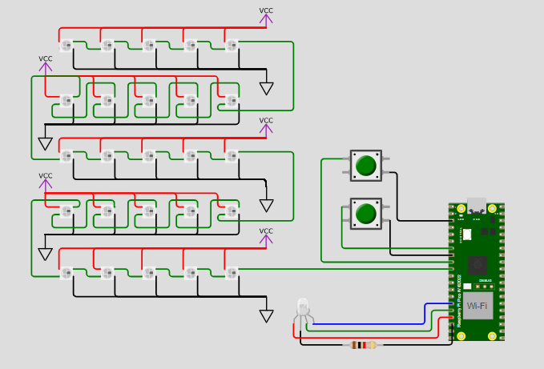

<h1 align="center"><br>Interruption BitDogLab</h1>

<h3 align="center">
   Interrupções na placa BitDogLab em Linguagem C
</h3>

---

Tabela de conteúdos
=================
<!--ts-->
   * [Sobre o projeto](#-sobre-o-projeto)
   * [Layout Repositorio Github](#-layout-repositorio-github)
   * [Funcionalidades](#-Funcionalidades)
   * [Como executar o projeto](#-como-executar-o-projeto)
   * [Imagens do Projeto](#-imagens-do-projeto)
     * [Imagem](#-projeto-na-extensão-wokwi-simulator-no-visual-studio)
     * [Vídeo](#-video-do-projeto)
   * [Tecnologias](#-tecnologias)
     * [Websites](#-websites)
     * [Utilitários](#user-content-server--nodejs----typescript)
   * [Contribuidores](#-contribuidores)
   * [Licença](#-licença)
<!--te-->

---

## 💻 Sobre o projeto

Este projeto implementa um sistema utilizando a placa BitDogLab com componentes como matriz de LEDs, LED RGB e botões, onde as interrupções são utilizadas para tratar eventos como incrementos e decrementos de um número exibido na matriz de LEDs. O LED RGB pisca em vermelho continuamente enquanto os botões A e B permitem aumentar ou diminuir o número mostrado.

Projeto desenvolvido durante o curso de Formação Básica em Software Embarcado oferecido pela [Embarcatech]. A Formação Básica em Software Embarcado da Embarcatech é um programa de capacitação profissional técnica destinado a alunos de nível superior e técnico em Tecnologias da Informação e Comunicação (TIC) e áreas correlatas, focado em tecnologias de Sistemas Embarcados.

Requisitos:

Matriz 5x5 de LEDs (conectada à GPIO 7)
LED RGB (conectado às GPIOs 11, 12 e 13)
Botão A (conectado à GPIO 5)
Botão B (conectado à GPIO 6)

---

## 🎨 Layout Repositorio Github
<i>
EmbarcaTech_U4_Matriz

- .vscode/&emsp;&emsp;&emsp;&emsp;# Arquivos .json
  - c_cpp_properties.json
  - cmake-kits.json
  - extensions.json
  - launch.json
  - settings.json
  - tasks.json

- assets/&emsp;&emsp;&emsp;&emsp;# Midias do Projeto
    - diagrama.png

- src/&emsp;&emsp;&emsp;&emsp;# códigos do projeto
  - buttons.c
  - buttons.h
  - led_rgb.c
  - led_rgb.h
  - matriz_led.c
  - matriz_led.h
  - numbers.c
  - numbers.h

- .gitignore

- CMakeLists.txt

- README.md

- diagram.json&emsp;&emsp;&emsp;&emsp;# Arquivo Wokwi do BitDogLab

- main.c&emsp;&emsp;&emsp;&emsp;# Código principal do projeto

- pico_sdk_import.cmake

- wokwi.toml

- ws2812.pio
</i>

---

## ⚙️ Funcionalidades
- O LED vermelho do LED RGB pisca 5 vezes por segundo.
- O botão A incrementa o número exibido na matriz a cada pressão.
- O botão B decrementa o número exibido na matriz a cada pressão.
- A matriz de LEDs é usada para criar efeitos visuais que representam números de 0 a 9.

---

## 🚀 Como executar o projeto

💡Siga as instruções abaixo para configurar, compilar e executar o programa.

### Pré-requisitos

Antes de começar, você vai precisar ter instalado em sua máquina as seguintes ferramentas:
  - Sistema operacional Linux, macOS ou Windows (com suporte a Makefile).
  - [Git](https://git-scm.com) (Opcional, mas recomendado),
  - [GCC compilador](https://gcc.gnu.org)
  - [Biblioteca Pico-Sdk](https://github.com/raspberrypi/pico-sdk.git) (OBS: Necessário caso queira modificar o projeto)

Além disto é bom ter um editor para trabalhar com o código como [VSCode](https://code.visualstudio.com/) com a extensão [Raspberry](https://marketplace.visualstudio.com/items?itemName=raspberry-pi.raspberry-pi-pico)  e usar o simulador web [Wokwi](https://wokwi.com) (ou a extensão do Vscode [Wokwi Simulator](https://marketplace.visualstudio.com/items?itemName=Wokwi.wokwi-vscode))

### 🎲 Dowload do Projeto

#### Dowload do Projeto no Desktop
- Opção 1:
  - Abra o terminal de comando Git Bash 
  - Clone o repositório do GitHub com o comando:
```
$ git clone https://github.com/Dyeorn/EmbarcaTech_U4_Matriz
```
- Opção 2:
  - No repósitorio [EMBARCATECH_U4_MATRIZ](https://github.com/Dyeorn/EmbarcaTech_U4_Matriz) aperte o Botão <i><>code</i>
  - Aperte a opção <i>Dowload ZIP</i>


### 🎲 Rodando a Animação no Wokwi

#### Wokwi Web
- Entre no navegador e digite [Wokwi.com]()
- Faça Upload dos Arquivos <i>diagram.json</i>
- Faça upload do aquivo main <i>main.c</i> e da pasta <i>src/</i>

#### Extensão Wokwi
- Abra o Visual Studio
- Na aba da extensão [Raspberry Pi Pico](https://marketplace.visualstudio.com/items?itemName=raspberry-pi.raspberry-pi-pico), aperte para Importar o projeto
- Compile o projeto
- crie um arquivo (caso não tenha no projeto) <i>wokwi.toml</i> e digite o código:
```
[wokwi]
version = 1
firmware = 'build/main.hex'
elf = 'build/main.elf'
```
- Abra o arquivo <i>diagram.json</i>


### 🎲 Rodando as Animações na placa BitdogLab

#### Placa BitDogLab
- Através de um cabo USB conecte a placa ao seu Disposito
- Aperte o Botão Bootsel e Reset 

#### VsCode Studio
- Abra o Visual Studio
- Na aba da extensão [Raspberry Pi Pico](https://marketplace.visualstudio.com/items?itemName=raspberry-pi.raspberry-pi-pico), aperte para Importar o projeto
- Compile o projeto
- Entre na pasta <i>build/</i>
- Cole o arquivo <i>nmain.uf2</i> no armazenamento placa BitDog
- Ou, apenas compile o projeto e clique em "Run Project (USB)
<br>

---

## 🎥 Imagens do Projeto

### 💿 Diagrama Visual do Projeto
<p align="center"></p>

### 💿 Video do Projeto na Extensão Wokwi


https://github.com/user-attachments/assets/video_demonstration.mp4


- Vídeo em HD: https://youtu.be/kVpC6IiY0Ps

---

## 🛠 Tecnologias

As seguintes ferramentas foram usadas na construção do projeto:

#### **Websites**
-   **[Visual Studio code](https://code.visualstudio.com)**
-   **[Github](https://github.com)**
-   **[Wokwi Web](https://gcc.gnu.org)**


#### **Utilitários**

-   Editor:  **[Visual Studio Code](https://code.visualstudio.com/)**  → Extensions:  **[C/C++](https://marketplace.visualstudio.com/items?itemName=ms-vscode.cpptools), [C/C++ Compile Run](https://marketplace.visualstudio.com/items?itemName=danielpinto8zz6.c-cpp-compile-run), [Raspberry Pi Pico](https://marketplace.visualstudio.com/items?itemName=raspberry-pi.raspberry-pi-pico) e [Wokwi Simulator](https://marketplace.visualstudio.com/items?itemName=Wokwi.wokwi-vscode)**
-   **[Git](https://git-scm.com)**


---

## 👨‍💻 Contribuidores

- João Pedro Jacó Leite
- Mentor: MANOEL MESSIAS DA SILVA JUNIOR

<table>
  <tr>
    <td align="center"><br/><a href="https://github.com/Dyeorn">João Pedro Jacó<a/><br/><br/><a href="https://github.com/ferreiramateusalencar/Conversor-de-Unidades-C" title="Integrante">🌐</a></td>
  </tr>
</table>
      
---


